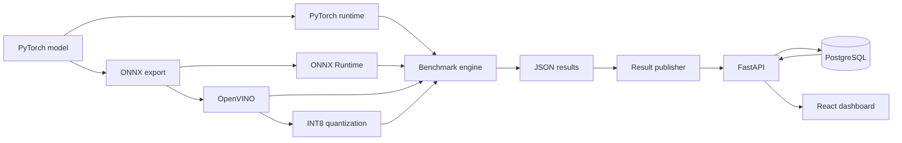

# EdgeForge

EdgeForge is a local ML deployment benchmarking platform for comparing PyTorch,
ONNX Runtime, and OpenVINO on the same hardware. It records benchmark results in
PostgreSQL, exposes them through FastAPI, and presents runtime and optimization
data in a React dashboard.

## What it demonstrates

- A shared runtime abstraction across PyTorch, ONNX Runtime, and OpenVINO
- Reproducible latency and throughput measurement with warm-up runs
- ResNet-18 export from PyTorch to ONNX
- OpenVINO post-training INT8 quantization
- Benchmark persistence through FastAPI, SQLAlchemy, and PostgreSQL
- Hardware-aware deployment recommendations in a React dashboard
- Automated linting, type checking, tests, frontend builds, and regression checks

## Architecture



## Measured results

The following batch-size-one measurements were recorded on Windows 11 with 12
physical CPU cores, 31.7 GB of memory, and an NVIDIA GeForce RTX 4060 Laptop GPU.
Results vary with hardware, power settings, drivers, and background activity.

| Runtime | Mean latency | Throughput |
| --- | ---: | ---: |
| ONNX Runtime CUDA | 1.88 ms | 532.0 items/s |
| PyTorch CUDA | 2.55 ms | 392.3 items/s |
| ONNX Runtime CPU | 10.26 ms | 97.5 items/s |
| OpenVINO CPU | 15.18 ms | 65.9 items/s |
| OpenVINO GPU | 33.24 ms | 30.1 items/s |
| PyTorch CPU | 38.28 ms | 26.1 items/s |

OpenVINO INT8 quantization reduced the model from 44.71 MB to 11.40 MB, a
74.5% reduction. The recorded comparison improved mean CPU latency from 16.04
ms to 3.41 ms, a 4.71x speedup.

## Project layout

```text
apps/              Runnable benchmark and optimization workflows
dashboard/         React and TypeScript dashboard
edgeforge_api/     FastAPI and PostgreSQL application
edgeforge_core/    Models, runtimes, benchmarking, and validation
worker/            Benchmark result publisher
tests/             Unit and API tests
configs/           Tracked performance baseline
scripts/           Local quality and regression commands
artifacts/         Generated models, reports, and benchmark output
```

## Requirements

- Python 3.12
- Node.js 24
- PostgreSQL 16 or later
- NVIDIA CUDA support is optional; CPU execution remains available

## Setup

Create and activate the Python environment:

```powershell
py -3.12 -m venv .venv
.\.venv\Scripts\Activate.ps1
python -m pip install --upgrade pip
python -m pip install -e ".[dev]"
```

Create the local configuration:

```powershell
Copy-Item .env.example .env
```

Create a PostgreSQL database and user that match the values in `.env`. Keep the
real `.env` local; Git ignores it.

Install the dashboard dependencies:

```powershell
cd dashboard
npm ci
cd ..
```

## Run the application

Start the API from the repository root:

```powershell
python -m uvicorn edgeforge_api.main:app --reload --host 127.0.0.1 --port 8000
```

Start the dashboard in a second terminal:

```powershell
cd dashboard
npm run dev
```

Open the URL printed by Vite. The API documentation is available at
`http://127.0.0.1:8000/docs`.

## Benchmark workflow

Generate and publish a runtime comparison:

```powershell
python -m apps.benchmark_resnet18
python -m worker.publish_results
```

Generate the OpenVINO INT8 model and optimization report:

```powershell
python -m apps.quantize_resnet18_int8
python -m apps.compare_openvino_int8
```

Generated models and results remain under `artifacts/` and are intentionally not
committed.

## API

| Method | Route | Purpose |
| --- | --- | --- |
| `GET` | `/health` | Verify API and database connectivity |
| `GET` | `/system` | Report host hardware information |
| `GET` | `/benchmarks` | List stored benchmark results |
| `POST` | `/benchmarks` | Store a benchmark result |
| `GET` | `/benchmarks/best/{model_id}` | Return the lowest-latency result |
| `GET` | `/optimization/resnet18` | Return the latest INT8 comparison |

## Quality gate

Run every local check with one command:

```powershell
.\scripts\check.ps1
```

The performance gate compares the current benchmark JSON with
`configs/performance_baseline.json` and fails when latency increases by more than
15%. Use `-SkipPerformance` when benchmark artifacts are unavailable:

```powershell
.\scripts\check.ps1 -SkipPerformance
```

GitHub Actions runs the deterministic Python and dashboard checks on pushes and
pull requests. Hardware performance is evaluated locally because hosted runners
cannot reproduce the reference machine.

## Current scope

EdgeForge currently focuses on ResNet-18 with batch size one and a local
PostgreSQL deployment. Future work could add multiple model families, configurable
batch sizes, experiment history, containerized deployment, and remote workers.
